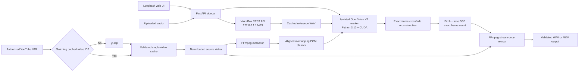

# VoiceBox STS Sidecar

Local, loopback-only speech-to-speech conversion for [Jamie Pine's VoiceBox](https://github.com/jamiepine/voicebox), powered by a pinned OpenVoice V2 runtime.

VoiceBox STS Sidecar accepts an existing speech recording, a video imported from the local PC, or an authorized YouTube video. It uses a cloned VoiceBox profile as the target voice and performs voice conversion locally on an NVIDIA GPU. The source performance supplies timing, pacing, emphasis, and emotion; the selected VoiceBox reference supplies the target speaker identity.

The Python package and on-screen application currently use the historical name **VoiceBox STS Bridge**. The GitHub repository is named **Voicebox-STS-Sidecar** because the application runs alongside VoiceBox without modifying it.

> [!IMPORTANT]
> Use only voices and source media that you own or have permission to process. Local-video and YouTube jobs require an explicit rights confirmation. This project does not bypass DRM, account restrictions, or access controls.

## Programmatic speech API

Send speech files, query VoiceBox voices, queue conversions, poll job status, and
download WAV results through the local HTTP API. See [API guide](docs/api.md)
and [Python client](examples/speech_client.py). Interactive docs are available
at `http://127.0.0.1:8765/docs` when the bridge is running.

## Status

This is a working Windows proof of concept with a production-oriented long-video path. It has been validated on CUDA-capable NVIDIA hardware; host-identifying specifications are intentionally not stored in this repository.

Current application version: **0.5.1**. The production-console interface uses a color-coded seven-stage workflow, live local-service badges, clearer technical facts, a video pipeline monitor, and a dependency board while preserving the existing accessible controls and responsive layout. The isolated inference runtime now enforces the security-fixed PyTorch 2.13 floor and verifies the converter checkpoint hash before deserialization.

Implemented:

- local VoiceBox health checks and cloned-profile discovery;
- automatic selection and caching when a profile has one reference sample;
- browser-native audio file selection and safe project-local uploads;
- source, target-reference, converted-audio, and completed-video players;
- full-precision OpenVoice V2 conversion on CUDA;
- atomic audio job manifests and validated WAV outputs;
- direct YouTube video downloads through a security-pinned yt-dlp runtime;
- a validated single-video YouTube download cache that avoids repeat network requests;
- streamed local-video imports with a native file picker, upload progress, and source preview;
- one shared conversion, timing, remux, and validation pipeline for imported and downloaded video;
- queued background video jobs with page-refresh recovery;
- one-model-load batch conversion for long audio;
- 256-sample-aligned chunks with one-second context overlap and crossfades;
- exact reconstructed PCM frame-count enforcement;
- profile-aware pitch correction and brightness/tone-depth controls;
- high-quality, formant-preserving pitch DSP with exact frame-count enforcement;
- unchanged video-stream remuxing with lossless FLAC audio in Matroska;
- complete FFmpeg decode validation before a video job is marked complete;
- responsive desktop/mobile web UI and a one-click Windows launcher.
- vivid, stage-specific visual language with real-time VoiceBox, OpenVoice, media-tool, cache, and job-state indicators;

Not implemented:

- dialogue/background source separation;
- conversion of only the dialogue stem while retaining an untouched music/effects bed;
- automatic recovery of an in-progress GPU job after the bridge process itself is terminated;
- DRM-protected, private, age-restricted, or account-cookie YouTube workflows;
- a packaged desktop executable or installer;
- subjective guarantees about voice identity or emotional similarity.

## Why a sidecar?

VoiceBox cloned profiles are not RVC `.pth` models. A profile contains metadata, one or more reference recordings, and their transcripts. VoiceBox's installed Qwen, Chatterbox, LuxTTS, or other weights are shared TTS engines rather than per-speaker speech-to-speech models.

This project therefore treats VoiceBox as an external local service:

1. Query VoiceBox's public loopback REST API.
2. Select a cloned profile and retrieve its reference WAV.
3. Extract a target-speaker embedding with OpenVoice V2.
4. Convert the original performance directly without transcribing it to text.
5. Save and validate the local result.

VoiceBox is not patched, its SQLite database is not opened, and the Applio installation is not modified.

## Architecture



| Component | Responsibility |
| --- | --- |
| `VoiceBoxClient` | Health, profiles, samples, and reference downloads through VoiceBox's loopback API |
| `MediaStore` | UUID-backed audio uploads and traversal-safe media resolution |
| `OpenVoiceEngine` | Bridge between the main Python environment and isolated CUDA inference worker |
| `openvoice_worker.py` | Safe model loading, single conversion, and one-load batch conversion |
| `ConversionService` | Serialized single-file jobs and atomic job manifests |
| `AudioEffectsProcessor` | Formant-preserving pitch shift, high-shelf tone shaping, peak limiting, and exact-frame validation |
| `YouTubeSourceCache` | Canonical video-ID matching, validated staging, atomic single-entry replacement, hit accounting, and safe clearing |
| `YouTubeJobService` | URL validation, download, extraction, chunking, conversion, reconstruction, remuxing, and decode validation |
| FastAPI application | Loopback API, background jobs, byte-range media serving, and web UI |

## Quality and timing model

### What is preserved

- The original video stream is copied with FFmpeg's `-c:v copy`; it is not re-encoded.
- Extracted, chunked, and reconstructed audio remains uncompressed 16-bit PCM.
- The final master uses lossless FLAC audio inside an MKV container.
- OpenVoice runs in FP32. The bridge does not use half-precision inference as a speed shortcut.
- Long-form chunk boundaries are multiples of OpenVoice's 256-sample frame size.
- Each chunk includes approximately one second of context on either side.
- Adjacent converted chunks are crossfaded over the shared context.
- The reconstructed WAV must contain exactly the same number of PCM frames as the duration-bounded extracted WAV.
- Pitch correction is a constant shift from -6 to +6 semitones using FFmpeg's high-quality Rubber Band filter. Tempo remains 1.0 and formant preservation is enabled.
- Brightness/tone depth is a -6 to +6 dB high shelf centered at 2.5 kHz. Negative values sound deeper/darker; positive values sound brighter.
- An adjustment is applied once to the fully converted track, followed by a transparent safety limiter only when necessary. The processor pads or trims to the exact original converted frame count and rejects any sample-rate or frame-count change.
- The final output timeline must be within 50 milliseconds of the probed video timeline.
- FFmpeg fully decodes the output video and audio streams before completion is reported.

### Model-imposed limit

OpenVoice V2 natively converts at **22.05 kHz mono**. The bridge does not downsample below that or use a performance-oriented quality mode, but it cannot recover stereo or frequencies that the model itself does not produce. Upsampling the result would increase file size without restoring information.

### Current soundtrack limitation

The YouTube path converts the complete soundtrack. If the source contains music, ambience, or effects, OpenVoice receives those elements too. Clean, dialogue-forward source videos work best. Preserving a high-fidelity stereo background bed requires a separately reviewed local source-separation model and is intentionally left for future work.

## Requirements

### Application host

- Windows 10 or Windows 11
- Jamie Pine's VoiceBox installed and available at `http://127.0.0.1:17493`
- Python 3.11, 3.12, or 3.13 for the FastAPI bridge
- Git
- FFmpeg and FFprobe on `PATH`
- Node.js 22 or newer for yt-dlp's current YouTube JavaScript runtime
- Miniconda or another Conda-compatible installation for the isolated Python 3.10 inference prefix

**macOS full conversion: no longer blocked upstream, but unverified in this repository.** `OpenVoiceEngine` locates its interpreter correctly on either platform (`.envs\openvoice-v2\python.exe` on Windows, `.envs/openvoice-v2/bin/python` on macOS/Linux), and an NVIDIA GPU is not required anywhere — see [Inference hardware](#inference-hardware) for the CPU fallback. Jamie Pine's VoiceBox now ships official macOS builds (Apple Silicon and Intel DMGs, MLX/Metal-backed) as of v0.5.0, so the earlier claim here that no macOS VoiceBox build existed is out of date. What remains true is that this repository has only been validated on macOS for the bridge server and the isolated OpenVoice CPU environment (installation, `engine-status`, and a real `engine-probe` model load all pass); nobody has yet exercised a full source-to-output conversion against a real VoiceBox instance on macOS. A Mac (iMac included) can install and run the FastAPI bridge itself — useful for UI development, running the test suite, or building a macOS binary of the bridge server — and with VoiceBox's own macOS build installed and reachable at `127.0.0.1:17493` on that same machine, full conversion should now be possible in principle. See [macOS: install and compile](#macos-install-and-compile).

### Inference hardware

- NVIDIA CUDA-capable GPU recommended; defaults to `cuda:0`
- Available VRAM determines practical source and chunk sizes; benchmark a short clip before long jobs
- No NVIDIA GPU? Set `BRIDGE_ENGINE_DEVICE=cpu` (or pass `--device cpu` to any CLI command) before launching. This runs the whole web workflow — probe, single conversions, YouTube jobs, and imported-video jobs — on CPU instead of CUDA. It works end to end but is much slower than a GPU, especially for long videos; the **Check the conversion engine** card on the page shows which device is actually configured.

### Disk and downloads

The repository intentionally excludes virtual environments, upstream source, model weights, cached references, uploads, downloads, and generated outputs.

One-time setup downloads include:

- the official CUDA-enabled PyTorch 2.13.0 wheel: **2,594,544,868 bytes** (about 2.42 GiB), plus its dependencies; on macOS this is instead the plain PyPI `torch==2.13.0` wheel (no CUDA build exists for macOS), about **111 MB**;
- OpenVoice source at a pinned Git revision;
- the OpenVoice V2 converter checkpoint: **131,320,490 bytes** (about 131 MB), MIT licensed.

Review these downloads and their licenses before installing them on another machine. Exact provenance is recorded in [`config/openvoice-v2.provenance.json`](config/openvoice-v2.provenance.json).

The YouTube source cache retains at most one active downloaded video under `data/youtube_cache/current/`. A replacement may temporarily require space for both the old active file and the new staged download; the old cache is removed immediately after the new file is validated and promoted. The configured per-video safety limit is 12 GiB.

## Quick start

If the bridge and inference environments already exist, there are two ways to run it:

**Compiled app (recommended for everyday use).** Double-click `VoiceBoxBridge.exe` in the repository root (see [Compiling a standalone app](#compiling-a-standalone-app) if it is not built yet). It runs with no console window, reuses an existing compatible bridge when possible, starts VoiceBox when necessary, launches the sidecar on `127.0.0.1:8765`, and opens the browser. A tray icon appears with **Open Bridge**, **View Logs**, and **Quit**; use Quit (or end the process) to stop the sidecar service — nothing keeps running in the background afterward.

**Console launcher (for development, or before the app is built).**

1. Start VoiceBox.
2. Double-click [`start-bridge.bat`](start-bridge.bat).
3. The launcher checks the local dependencies, reuses an existing bridge when possible, starts VoiceBox when necessary, launches the sidecar on `127.0.0.1:8765`, and opens the browser.
4. Closing the bridge console stops the sidecar service.

Run a non-launching preflight from PowerShell:

```powershell
cmd /c start-bridge.bat --check
```

Open the UI directly at <http://127.0.0.1:8765>. If something looks wrong and there is no console to read (the compiled app), expand the **Diagnostics** panel at the bottom of the page for a live tail of the log file, or use the tray icon's **View Logs**.

## Complete installation from a fresh clone

The commands below are intended for PowerShell from the repository root.

### 1. Install and verify system tools

```powershell
git --version
python --version
conda --version
ffmpeg -version
ffprobe -version
node --version
```

Node must be version 22 or newer. Confirm VoiceBox is running:

```powershell
Invoke-RestMethod http://127.0.0.1:17493/health
```

### 2. Create the bridge environment

```powershell
python -m venv .venv
.\.venv\Scripts\python.exe -m pip install --upgrade pip
.\.venv\Scripts\python.exe -m pip install -e ".[dev]"
```

This installs FastAPI, Uvicorn, pytest, and a patched yt-dlp release. The project requires yt-dlp `2026.7.4` or newer within the 2026 release series because earlier builds are below the configured security floor.

### 3. Create the isolated OpenVoice environment

```powershell
conda create --prefix ".\.envs\openvoice-v2" python=3.10.20 pip -y
```

Install PyTorch first. PyTorch 2.13.0 is the minimum accepted version because earlier releases are covered by the repository's reviewed security advisories.

With an NVIDIA GPU, install the pinned CUDA 12.6 build:

```powershell
.\.envs\openvoice-v2\python.exe -m pip install --index-url https://download.pytorch.org/whl/cu126 torch==2.13.0
```

Without an NVIDIA GPU, install the CPU-only build instead (a much smaller download, no CUDA runtime included), and set `BRIDGE_ENGINE_DEVICE=cpu` before launching the bridge:

```powershell
.\.envs\openvoice-v2\python.exe -m pip install --index-url https://download.pytorch.org/whl/cpu torch==2.13.0
$env:BRIDGE_ENGINE_DEVICE = "cpu"
```

CPU inference works through the full web workflow but is significantly slower than CUDA, especially for long videos.

Install only the direct converter dependencies. Do not install OpenVoice's full historical requirements file; it pulls unrelated demos, transcription stacks, and cloud-facing packages.

```powershell
.\.envs\openvoice-v2\python.exe -m pip install `
  numpy==1.26.4 `
  librosa==0.10.2.post1 `
  soundfile==0.12.1 `
  inflect==7.0.0 `
  Unidecode==1.3.7 `
  eng_to_ipa==0.0.2 `
  pypinyin==0.50.0 `
  jieba==0.42.1 `
  cn2an==0.5.22
```

The audited versions are also listed in [`config/openvoice-v2.direct-requirements.txt`](config/openvoice-v2.direct-requirements.txt).

### 4. Check out the pinned OpenVoice source

```powershell
git clone https://github.com/myshell-ai/OpenVoice third_party/OpenVoice
git -C third_party/OpenVoice checkout 74a1d147b17a8c3092dd5430504bd83ef6c7eb23
git -C third_party/OpenVoice rev-parse HEAD
```

The final command must print:

```text
74a1d147b17a8c3092dd5430504bd83ef6c7eb23
```

The source is imported directly from `third_party/OpenVoice`; it does not need to be installed as a package.

### 5. Download and verify the OpenVoice V2 converter

The approved checkpoint is approximately 131 MB and MIT licensed.

```powershell
$modelRevision = "f36e7edfe1684461a8343844af60babc2efbb727"
$modelBase = "https://huggingface.co/myshell-ai/OpenVoiceV2/resolve/$modelRevision/converter"
$modelDirectory = "data\models\openvoice-v2\converter"
New-Item -ItemType Directory -Path $modelDirectory -Force | Out-Null
Invoke-WebRequest -Uri "$modelBase/config.json?download=true" -OutFile "$modelDirectory\config.json"
Invoke-WebRequest -Uri "$modelBase/checkpoint.pth?download=true" -OutFile "$modelDirectory\checkpoint.pth"
(Get-FileHash "$modelDirectory\checkpoint.pth" -Algorithm SHA256).Hash.ToLower()
```

The expected SHA-256 is:

```text
9652c27e92b6b2a91632590ac9962ef7ae2b712e5c5b7f4c34ec55ee2b37ab9e
```

Do not continue if the hash differs.

### 6. Verify the runtime

```powershell
$env:PYTHONPATH = "src"
.\.venv\Scripts\python.exe -m voicebox_sts_bridge engine-status
.\.venv\Scripts\python.exe -m voicebox_sts_bridge engine-probe
cmd /c start-bridge.bat --check
```

`engine-status` checks files and imports without loading the model. `engine-probe` performs a real model load on the configured device (`cuda:0` by default; pass `--device cpu` for a CPU-only machine) and reports device and peak-memory information.

### 7. Launch

```powershell
cmd /c start-bridge.bat
```

## Compiling a standalone app

Steps 1–6 above must already be done (dependencies installed, the OpenVoice environment and checkpoint in place) before compiling. The compiled app is a launcher around the same bridge code; it does not replace steps 1–6.

### Windows: build `VoiceBoxBridge.exe`

```powershell
.\.venv\Scripts\python.exe -m pip install pyinstaller pillow pystray
.\build_assets\build.bat
```

This regenerates the icon (`build_assets\icon.ico`), builds a windowed, single-file executable with PyInstaller, and copies it to `VoiceBoxBridge.exe` in the repository root. It must stay there, next to `.envs\` and `start-bridge.bat`, because it locates the isolated OpenVoice environment relative to its own folder (it also tolerates being run once out of `dist\`, but not moved somewhere unrelated).

The result:

- No console window. Uvicorn runs inside the same process as the launcher, so ending that one process always stops the server — nothing is left running.
- A system-tray icon with **Open Bridge**, **View Logs**, and **Quit**.
- Logs go to a rotating file at `data\logs\bridge.log` (capped around 4 MB) instead of a console, and are also viewable from the web UI's **Diagnostics** panel (`GET /api/logs`).
- Hard startup failures (for example, port 8765 owned by another application) are reported with a Windows message box, since there is no console to print to.

Rebuild any time after changing bridge code by re-running `build_assets\build.bat`.

### macOS: install and compile

This builds and runs the FastAPI bridge server on macOS (including Apple Silicon iMacs). On its own it does **not** give you a validated conversion path — see the platform note under [Requirements](#requirements). It is useful for developing the web UI, running the test suite, or exercising the bridge's HTTP API against a VoiceBox/OpenVoice pair reachable at `127.0.0.1` on that same Mac, if you have separately set one up. VoiceBox itself now publishes macOS DMGs directly from its own project (Apple Silicon and Intel), so that half of the setup no longer requires an undocumented workaround — only the combination has not been exercised end to end here.

**Install:**

```bash
brew install python@3.12 ffmpeg node git
git clone <this repository's URL>
cd Voicebox-STS-Sidecar
python3.12 -m venv .venv
./.venv/bin/python -m pip install --upgrade pip
./.venv/bin/python -m pip install -e ".[dev]"
```

Node must be version 22 or newer (`node --version`); install one with `brew install node@22` if Homebrew's default is older.

**Isolated OpenVoice environment (optional, CPU/MPS — no NVIDIA GPU exists on a Mac):**

This is the macOS equivalent of steps 3–5 under [Complete installation from a fresh clone](#complete-installation-from-a-fresh-clone), with the differences that actually come up on macOS called out below.

```bash
brew install --cask miniconda   # or another Conda-compatible installation
```

Conda's default `defaults`/`pkgs/main` channels now gate `conda create` behind an interactive Anaconda Terms-of-Service acceptance (`conda tos accept ...`), which blocks a non-interactive setup. Using the community-run conda-forge channel instead sidesteps that entirely:

```bash
conda create --prefix "./.envs/openvoice-v2" -c conda-forge --override-channels python=3.10.20 pip -y
```

Install PyTorch — on macOS there is no separate CUDA/CPU wheel to choose between (Apple Silicon has no CUDA at all), so this is just a plain install; it runs on the CPU or, where the installed OpenVoice/PyTorch build supports it, Apple's MPS backend:

```bash
./.envs/openvoice-v2/bin/python -m pip install torch==2.13.0
```

Install the same pinned direct converter dependencies as the Windows instructions (versions are also listed in [`config/openvoice-v2.direct-requirements.txt`](config/openvoice-v2.direct-requirements.txt)):

```bash
./.envs/openvoice-v2/bin/python -m pip install \
  numpy==1.26.4 \
  librosa==0.10.2.post1 \
  soundfile==0.12.1 \
  inflect==7.0.0 \
  Unidecode==1.3.7 \
  eng_to_ipa==0.0.2 \
  pypinyin==0.50.0 \
  jieba==0.42.1 \
  cn2an==0.5.22
```

Check out the pinned OpenVoice source (same commands as Windows):

```bash
git clone https://github.com/myshell-ai/OpenVoice third_party/OpenVoice
git -C third_party/OpenVoice checkout 74a1d147b17a8c3092dd5430504bd83ef6c7eb23
git -C third_party/OpenVoice rev-parse HEAD   # must print 74a1d147b17a8c3092dd5430504bd83ef6c7eb23
```

Download and verify the converter checkpoint (~131 MB, MIT licensed; see [Disk and downloads](#disk-and-downloads) for full provenance):

```bash
modelRevision="f36e7edfe1684461a8343844af60babc2efbb727"
modelBase="https://huggingface.co/myshell-ai/OpenVoiceV2/resolve/$modelRevision/converter"
modelDirectory="data/models/openvoice-v2/converter"
mkdir -p "$modelDirectory"
curl -fL "$modelBase/config.json?download=true" -o "$modelDirectory/config.json"
curl -fL "$modelBase/checkpoint.pth?download=true" -o "$modelDirectory/checkpoint.pth"
shasum -a 256 "$modelDirectory/checkpoint.pth"   # must print 9652c27e92b6b2a91632590ac9962ef7ae2b712e5c5b7f4c34ec55ee2b37ab9e
```

Verify the runtime (`--device` is a *global* option and must come before the subcommand, not after it):

```bash
export PYTHONPATH=src
export BRIDGE_ENGINE_DEVICE=cpu
./.venv/bin/python -m voicebox_sts_bridge engine-status
./.venv/bin/python -m voicebox_sts_bridge --device cpu engine-probe
```

`engine-probe` on CPU performs a real model load — expect it to take on the order of a minute, much slower than a CUDA GPU.

**Run in development mode:**

```bash
PYTHONPATH=src ./.venv/bin/python -m voicebox_sts_bridge engine-status
PYTHONPATH=src ./.venv/bin/python -m voicebox_sts_bridge serve
```

Open <http://127.0.0.1:8765>. `engine-status` will report the OpenVoice checks as missing unless the isolated OpenVoice environment above also exists at `.envs/openvoice-v2/bin/python` (conda places the interpreter under `bin/` on macOS and Linux, not directly in the prefix as on Windows — the bridge detects this automatically). Installing VoiceBox itself on macOS is not covered by this README — see VoiceBox's own project for its macOS DMG (its GitHub releases carry a `Voicebox_<version>_aarch64.dmg` for Apple Silicon and `Voicebox_<version>_x64.dmg` for Intel; the download page at voicebox.sh is a JS-driven redirect rather than a direct file link).

**Compile a standalone binary:**

```bash
./.venv/bin/python -m pip install pyinstaller pillow
./.venv/bin/python build_assets/make_icon.py   # also writes build_assets/icon.icns

./.venv/bin/python -m PyInstaller \
  --onefile \
  --name VoiceBoxBridge \
  --icon build_assets/icon.icns \
  --paths src \
  --add-data "src/voicebox_sts_bridge/static:voicebox_sts_bridge/static" \
  --add-data "src/voicebox_sts_bridge/openvoice_worker.py:voicebox_sts_bridge" \
  --collect-all uvicorn \
  --hidden-import voicebox_sts_bridge.api \
  build_assets/console_launcher.py
```

The entry point is `build_assets/console_launcher.py`, not the package's own `src/voicebox_sts_bridge/__main__.py` — the latter uses a relative import (`from .cli import main`) that fails once PyInstaller runs it as a top-level script instead of as part of the package.

Run it from Terminal with no arguments for the everyday launcher experience:

```bash
./dist/VoiceBoxBridge
```

This mirrors `start-bridge.bat`/`launcher.py`'s startup sequence — minus the Windows-only tray icon and `ctypes` message boxes, so it stays a foreground console process (`Ctrl+C` to stop) instead of a windowed/tray app:

- Reuses a compatible bridge that is already running (just opens the browser and exits) instead of starting a second one.
- Refuses to start, with an error, if port 8765 is owned by something other than this project's own bridge.
- Replaces a stale bridge process left over from an older build of this same project.
- If VoiceBox isn't already reachable at `127.0.0.1:17493`, tries to open `/Applications/Voicebox.app` (override with a full `.app` path via `VOICEBOX_APP`; falls back to name-based `open -a Voicebox` only if that path doesn't exist — useful if more than one app is registered under that name, which resolves unpredictably) and waits up to 30 seconds for it to become healthy before continuing anyway.
- Opens the default browser to `http://127.0.0.1:8765` automatically once the bridge reports ready.

Any explicit subcommand still works the same as the raw CLI, e.g. `./dist/VoiceBoxBridge engine-status` or `./dist/VoiceBoxBridge serve` (the plain `serve` subcommand skips the reuse/VoiceBox/auto-open sequence above and just starts the server directly, same as on the venv's Python).

## Using the web UI

### Choose a target voice

1. Select a cloned VoiceBox profile.
2. If the profile contains one reference, the sidecar selects and caches it automatically.
3. If it contains multiple references, choose the cleanest representative recording.
4. Use **Audition selected reference** to hear the cached target.

A clean 15–30 second single-speaker reference is generally more useful than a longer noisy recording. The currently validated VoiceBox samples are approximately 24–29 seconds.

### Shape pitch and tone

The controls apply to local-audio, imported-video, and YouTube jobs:

- **Pitch correction** shifts the whole converted performance from -6 to +6 semitones without changing its speed. This is a manual pitch offset, not Auto-Tune or note-by-note correction.
- **Brightness / tone depth** applies up to 6 dB of high-frequency shelf adjustment. Move left for a darker/deeper result or right for a brighter result.
- Settings are saved locally in the browser for each VoiceBox profile. Switching voices restores that voice's last values.
- When VoiceBox reports an enabled profile `pitch_shift` effect, the sidecar uses it as that profile's initial pitch default because OpenVoice does not otherwise apply VoiceBox's TTS effects chain.
- **Reset to profile defaults** clears the saved values for the selected voice and restores its detected VoiceBox pitch setting plus neutral tone.

Start with small changes and audition the result. A range of roughly 0.5 to 2 semitones or 1 to 3 dB is usually a better diagnostic starting point than an extreme setting. Set both sliders to zero for the original OpenVoice output.

### Convert a local audio file

1. Click **Choose source audio…** to open the Windows file picker.
2. Choose an authorized `.wav`, `.mp3`, `.flac`, `.m4a`, `.aac`, `.ogg`, `.opus`, or `.wma` file.
3. Audition the uploaded source in the right-hand player.
4. Set pitch and tone as needed, or leave both at zero.
5. Click **Convert with selected profile**.
6. After completion, audition the result and expand the job details if needed.

Uploads are streamed to UUID-named files under `data/inputs/`. The default upload safety limit is 1 GiB.

### Convert a YouTube video

1. Select the target VoiceBox profile.
2. Paste a direct HTTPS YouTube video URL. Watch, Shorts, Live-video, Embed, and `youtu.be` links are accepted when they identify one video.
3. Set pitch and tone as needed.
4. Confirm that you own the video or have permission to process it.
5. Click **Download, cache, and convert video**. If the entered video ID matches the active cache, the button changes to **Convert using cached video** and yt-dlp is skipped.
6. Leave the bridge console running. The page displays cache lookup, download or reuse, extraction, conversion, reconstruction, post-processing, remux, and validation stages.
7. A page refresh reconnects to the latest job stored in browser local storage.
8. When complete, use the right-hand video player or save the MKV master.

The URL validator rejects arbitrary hosts, HTTP URLs, credentials, custom ports, playlists without a direct video, channels, and search pages. yt-dlp is configured for one item and ignores user-level yt-dlp configuration files.

The cache is keyed by the canonical YouTube video ID, so equivalent Watch, Shorts, Embed, Live-recording, and `youtu.be` links reuse the same source. The cache panel shows its title, size, and reuse count. **Clear cache** removes only the cached source; completed MKV outputs and durable job records are preserved. Rights confirmation remains mandatory on cache hits.

### Convert a video from this PC

1. Select the target VoiceBox profile and set pitch/tone as needed.
2. In **Import a video from this PC**, click **Choose video from this PC**. The native Windows file picker accepts common containers including MP4, MKV, MOV, WebM, AVI, M4V, WMV, MPEG, TS, and M2TS.
3. Watch the import progress and use the right-hand local-video player to inspect the selected source. If the browser cannot decode its original container or codec, FFmpeg can still process it.
4. Confirm that you own the video or have permission to process it.
5. Click **Convert imported video** and leave the bridge console running.
6. Follow extraction, chunk conversion, exact-timing reconstruction, optional pitch/tone processing, lossless remux, and full validation progress.
7. When complete, play or save the same MKV master used by the YouTube workflow.

Imported videos are streamed to UUID-named files under `data/video_inputs/`; the browser never sends an arbitrary filesystem path to the conversion API. The default video upload safety limit is 12 GiB. Imported sources do not affect the single-video YouTube download cache.

## Long-video pipeline

Each video job passes through these durable stages. YouTube jobs use the download-cache acquisition steps below; imported-video jobs instead validate their contained UUID-addressed upload, skip all downloader/network work, and then join the identical pipeline at audio extraction:

1. **Queued** — an atomic manifest is created under `data/video_jobs/JOB_ID/`.
2. **Acquiring the source** — a YouTube job checks the canonical video ID against the validated cache; an imported-video job validates its project-contained upload.
3. **Validating media streams** — a YouTube cache miss downloads and publishes safely, while a local job skips the network; both paths require video and audio streams before extraction.
4. **Extracting audio** — FFmpeg bounds the extraction to the probed video timeline and creates 22.05 kHz mono PCM.
5. **Preparing chunks** — approximately 30-second cores receive one-second left/right context; all inference inputs are padded to multiples of 256 samples.
6. **Converting chunks** — one isolated worker loads the OpenVoice model and target embedding once, then converts every chunk sequentially on the GPU.
7. **Reconstructing** — overlapping converted regions are linearly crossfaded and cropped to the exact source frame count.
8. **Applying pitch and tone** — optional adjustments run once on the complete reconstructed track; output is forced back to the exact source frame count.
9. **Remuxing** — FFmpeg copies the original video stream and adds lossless FLAC audio in MKV.
10. **Validating** — FFprobe verifies codecs and duration; FFmpeg decodes both streams with error-on-failure behavior.
11. **Completed** — the final media route becomes available only after every check passes.

GPU jobs share one lock, so local audio, imported video, and YouTube conversions cannot compete for VRAM. Both video entry points also share one pipeline lock, so only one video job runs at a time.

## CLI reference

Set the source tree on `PYTHONPATH` when the editable package is not active:

```powershell
$env:PYTHONPATH = "src"
```

```powershell
python -m voicebox_sts_bridge health
python -m voicebox_sts_bridge profiles
python -m voicebox_sts_bridge samples PROFILE_ID
python -m voicebox_sts_bridge fetch-reference PROFILE_ID SAMPLE_ID
python -m voicebox_sts_bridge engine-status
python -m voicebox_sts_bridge engine-probe
python -m voicebox_sts_bridge convert SOURCE_AUDIO PROFILE_ID SAMPLE_ID
python -m voicebox_sts_bridge convert SOURCE_AUDIO PROFILE_ID SAMPLE_ID --output OUTPUT.wav --tau 0.3
python -m voicebox_sts_bridge convert SOURCE_AUDIO PROFILE_ID SAMPLE_ID --pitch-semitones -1.5 --brightness-db -2
python -m voicebox_sts_bridge serve --host 127.0.0.1 --port 8765
```

The imported-video and YouTube workflows are intentionally web/API based because they are asynchronous and expose upload/stage/chunk progress.

## HTTP API

Interactive OpenAPI documentation is available at <http://127.0.0.1:8765/docs> while the bridge is running.

| Method | Route | Purpose |
| --- | --- | --- |
| `GET` | `/api/voicebox/health` | Proxy the local VoiceBox health response |
| `GET` | `/api/profiles` | List VoiceBox profiles |
| `GET` | `/api/profiles/{profile_id}/samples` | List samples for one profile |
| `POST` | `/api/references` | Cache and validate one reference WAV |
| `GET` | `/api/engine/status` | Check isolated engine readiness without loading the model |
| `POST` | `/api/engine/probe` | Load the model on the configured device and report readiness |
| `POST` | `/api/inputs?filename=...` | Stream a raw browser-selected audio file into local storage |
| `POST` | `/api/conversions` | Run one synchronous local-audio conversion |
| `POST` | `/api/video-inputs?filename=...` | Stream a raw browser-selected video into isolated local storage |
| `GET` | `/api/video/status` | Check FFmpeg/FFprobe readiness for imported video |
| `POST` | `/api/video/jobs` | Create an authorized asynchronous imported-video job |
| `GET` | `/api/video/jobs/{job_id}` | Read either kind of durable video job status and chunk progress |
| `GET` | `/api/youtube/status` | Check yt-dlp, Node, FFmpeg, and FFprobe readiness |
| `GET` | `/api/youtube/cache` | Read the validated single-video download cache status |
| `DELETE` | `/api/youtube/cache` | Clear the cached source without deleting completed outputs |
| `POST` | `/api/youtube/jobs` | Create an authorized asynchronous video job |
| `GET` | `/api/youtube/jobs/{job_id}` | Read durable job status and chunk progress |
| `GET` | `/api/media/inputs/{input_id}` | Stream an uploaded source with byte-range support |
| `GET` | `/api/media/video-inputs/{video_input_id}` | Stream an imported video with byte-range support |
| `GET` | `/api/media/outputs/{job_id}` | Stream a converted WAV |
| `GET` | `/api/media/references/{profile_id}/{sample_id}` | Stream a cached VoiceBox reference |
| `GET` | `/api/media/video-jobs/{job_id}` | Stream or save a completed MKV master |

### Example video-job request

```json
{
  "youtube_url": "https://www.youtube.com/watch?v=VIDEO_ID",
  "profile_id": "VOICEBOX_PROFILE_UUID",
  "sample_id": "VOICEBOX_SAMPLE_UUID",
  "tau": 0.3,
  "pitch_semitones": -1.5,
  "brightness_db": -2.0,
  "authorized": true
}
```

An imported-video job uses the same fields but replaces `youtube_url` with the `video_input_id` returned by `/api/video-inputs`. Both adjustment fields default to `0.0` and accept values from `-6.0` through `+6.0`. Local `/api/conversions` requests accept the same fields. Completed local and video manifests record the requested values, whether DSP ran, the filter configuration, and the verified output audio geometry.

## Configuration

| Environment variable | Default | Description |
| --- | --- | --- |
| `VOICEBOX_BASE_URL` | `http://127.0.0.1:17493` | VoiceBox REST API; must be an HTTP loopback URL |
| `BRIDGE_HOST` | `127.0.0.1` | Sidecar bind address; must resolve to loopback |
| `BRIDGE_PORT` | `8765` | Sidecar HTTP port |
| `BRIDGE_DATA_DIR` | `data` | Root for models, caches, inputs, manifests, and outputs |
| `BRIDGE_ENGINE_DEVICE` | `cuda:0` | OpenVoice inference device: `cpu`, `cuda`, or `cuda:<index>` |

Non-loopback VoiceBox URLs and bridge hosts are rejected by configuration validation.

Every CLI command also accepts `--device` to override `BRIDGE_ENGINE_DEVICE` for a single run, for example `voicebox-sts-bridge --device cpu engine-probe`.

## Runtime data layout

Runtime artifacts stay local and are excluded from Git.

```text
data/
├── inputs/                         # Browser-uploaded audio + JSON metadata
├── video_inputs/                   # Browser-uploaded video + JSON metadata
├── jobs/                           # Single-audio atomic job manifests
├── models/openvoice-v2/converter/  # Hash-verified config and checkpoint
├── outputs/                        # Converted WAV files
├── references/PROFILE_ID/          # Cached VoiceBox WAV/JSON references
├── youtube_cache/
│   └── current/
│       ├── manifest.json           # Video ID, checksum, metadata, probe, hit count
│       └── source.*                # The only active downloaded source video
└── video_jobs/JOB_ID/
    ├── manifest.json               # Durable job state
    ├── conversion-progress.json    # Worker-side chunk progress
    ├── audio/                       # Extracted and reconstructed PCM WAVs
    ├── chunks/source/               # Context-overlapped inference inputs
    ├── chunks/converted/            # Converted chunks
    └── output.mkv                   # Copied video + lossless FLAC master
```

Audio/chunk intermediates are intentionally retained for debugging, quality review, and future recovery work. YouTube jobs reference the reusable cache rather than retaining a private duplicate of the downloaded source; imported-video jobs reference their file under `video_inputs/`. Legacy job directories created before version 0.3 may still contain `download/` folders. Long videos and imported originals can require substantial disk space.

## Repository layout

```text
config/                              # Pinned dependency and model provenance
docs/                                # Engine audit and privacy-safe validation notes
build_assets/                        # Icon generator, PyInstaller launcher, and build.bat
src/voicebox_sts_bridge/             # Application package
src/voicebox_sts_bridge/audio_effects.py # Exact-duration pitch and tone DSP
src/voicebox_sts_bridge/logging_setup.py # Rotating log file used by the app and the compiled launcher
src/voicebox_sts_bridge/static/      # Single-page web UI
tests/                               # Unit and pipeline tests
AGENTS.md                            # Project architecture and operating constraints
pyproject.toml                       # Package metadata and dependencies
start-bridge.bat                     # Windows console launcher/preflight
VoiceBoxBridge.exe                   # Compiled Windows app (built locally; not committed - see Compiling a standalone app)
```

The following large or machine-specific folders are deliberately ignored:

```text
.venv/
.envs/
.cache/
third_party/
data/*
output/
build/
dist/
VoiceBoxBridge.exe
```

## Development and tests

Install development dependencies:

```powershell
.\.venv\Scripts\python.exe -m pip install -e ".[dev]"
```

Run the test suite:

```powershell
$env:PYTHONPATH = "src"
.\.venv\Scripts\python.exe -m pytest
```

Compile-check the Python sources:

```powershell
.\.venv\Scripts\python.exe -m compileall -q src tests
```

Check the inline browser JavaScript:

```powershell
$html = Get-Content -Raw -Encoding UTF8 src\voicebox_sts_bridge\static\index.html
$script = [regex]::Match($html, '<script>([\s\S]*?)</script>').Groups[1].Value
$script | node --check
```

Current suite status: **71 tests passing**.

## Security and privacy

- The bridge binds only to loopback and rejects non-loopback configuration.
- VoiceBox is accessed only through its public local REST API.
- OpenVoice inference runs locally with Hugging Face, Datasets, and Transformers offline flags forced in the worker.
- The worker refuses PyTorch versions older than 2.13.0, verifies the converter checkpoint against the tracked SHA-256 before deserialization, uses `torch.load(..., weights_only=True)`, and validates missing/unexpected state keys.
- The upstream watermark dependency is not loaded; the audited converter subclass disables watermark processing.
- Browser uploads are streamed atomically, use UUID filenames, enforce separate audio/video extension allowlists, and are capped at 1 GiB for audio and 12 GiB for video.
- Media routes accept validated UUIDs and enforce directory containment.
- Local-video conversion accepts only a server-resolved upload ID; caller-provided filesystem paths are never accepted.
- Responses use byte-range support, `Cache-Control: no-store`, and `X-Content-Type-Options: nosniff`.
- YouTube URLs are restricted to direct HTTPS YouTube hosts and one-video paths.
- yt-dlp user configuration is ignored, playlists are disabled, and the project refuses yt-dlp versions below the configured security floor.
- Cached media is accepted only from a contained staging directory after its requested/returned YouTube IDs, size, container, audio/video streams, and SHA-256 metadata are validated. Replacement and clearing are constrained to `data/youtube_cache/`.
- No cloud inference API, paid service, subscription, or per-minute dependency is used.
- A cache miss necessarily contacts YouTube; a validated cache hit does not. Inference, cached media, and generated outputs remain local.

Do not expose this prototype to a LAN or the public internet without a separate authentication, CSRF, rate-limit, and threat-model review.

## Validation

The pinned OpenVoice source and model revisions, exact-frame reconstruction, one-load chunk processing, lossless video remux, pitch/tone timing safeguards, and full-decode checks have been validated locally. Machine specifications, cloned-profile names, source filenames, job identifiers, and performance fingerprints are intentionally excluded from source control.

The long-video implementation prevents cumulative chunk drift by aligning and padding inference inputs, then enforcing the exact extracted frame count during reconstruction. Privacy-safe validation details are in [`docs/validation.md`](docs/validation.md).

## Troubleshooting

### VoiceBox shows unavailable

- Start VoiceBox and confirm <http://127.0.0.1:17493/health> responds.
- Confirm no firewall or proxy is intercepting loopback HTTP.
- Verify `VOICEBOX_BASE_URL` has no credentials, query string, or fragment.
- **On macOS, if more than one app is registered under the name "Voicebox"** (for example a stray copy left on the Desktop alongside the real install in `/Applications`, or a locally built dev copy), name-based lookup (`open -a Voicebox`) can resolve to the wrong one and launch a copy that opens and exits within a second without ever starting its server — this was observed happening in practice. `build_assets/console_launcher.py`'s bare-invocation launcher avoids this by opening `/Applications/Voicebox.app` by explicit path (override with a full `.app` path via `VOICEBOX_APP`), but if you're launching VoiceBox some other way and it still won't come up, check which copy actually answered on the port:

  ```bash
  ps aux | grep -i voicebox
  lsof -nP -iTCP:17493 -sTCP:LISTEN
  ```

  Also avoid stopping VoiceBox with a plain `kill` on its main process — that orphans its `voicebox-server` child sidecar, which keeps listening on 17493 with a now-dead parent PID and can be mistaken for a healthy instance. Quit it from its own UI, or kill both the parent and the `voicebox-server` children.

### Engine status says installation incomplete or insecure

Check all of these paths:

```text
.envs/openvoice-v2/python.exe        (Windows)
.envs/openvoice-v2/bin/python        (macOS/Linux)
third_party/OpenVoice/
data/models/openvoice-v2/converter/config.json
data/models/openvoice-v2/converter/checkpoint.pth
config/openvoice-v2.provenance.json
```

Then run (PowerShell shown; on macOS/Linux use `PYTHONPATH=src ./.venv/bin/python -m voicebox_sts_bridge engine-status`):

```powershell
$env:PYTHONPATH = "src"
.\.venv\Scripts\python.exe -m voicebox_sts_bridge engine-status
```

If you are running a compiled build (`VoiceBoxBridge.exe` on Windows, `dist/VoiceBoxBridge` on macOS), this usually means it was moved somewhere other than the repository root (it locates `.envs/` relative to its own folder, with a one-level fallback for `dist/`). Move it back next to `start-bridge.bat` (Windows) or the repository root (macOS), or set `BRIDGE_PROJECT_ROOT` to the repository's absolute path.

### CUDA probe fails

- Confirm the isolated environment contains `torch==2.13.0+cu126`, not an older or CPU-only build.
- Run `nvidia-smi` and confirm the NVIDIA driver detects the GPU.
- Do not install the ML packages into the main Python 3.13 bridge environment.
- No compatible NVIDIA GPU on this machine at all? Install the CPU-only PyTorch build instead (see [step 3](#3-create-the-isolated-openvoice-environment)) and set `BRIDGE_ENGINE_DEVICE=cpu` — this is a legitimate, working configuration, just slower than CUDA.

### YouTube tools are not ready

```powershell
.\.venv\Scripts\python.exe -m pip show yt-dlp
node --version
ffmpeg -version
ffprobe -version
```

The app requires yt-dlp 2026.7.4 or newer within the 2026 series and Node 22 or newer.

### Pitch or tone processing fails

The installed FFmpeg build must expose the `rubberband`, `highshelf`, and `alimiter` audio filters:

```powershell
ffmpeg -hide_banner -filters | findstr /i "rubberband highshelf alimiter"
```

If `rubberband` is absent, install an FFmpeg build compiled with `librubberband`; setting both controls to zero bypasses this post-processing stage.

### A YouTube download fails

- Confirm the URL identifies one public video and begins with `https://`.
- Playlists, channels, search pages, custom ports, arbitrary hosts, and HTTP URLs are rejected.
- Private, age-restricted, region-restricted, DRM-protected, or login-required content is outside the supported workflow.
- Inspect `data/video_jobs/JOB_ID/manifest.json` for the exact failed stage and diagnostic.

### A YouTube video downloads again instead of using the cache

- Confirm the cache panel shows an active video and that the entered link resolves to the same YouTube video ID.
- The first job after upgrading from a pre-0.3 release must populate the new cache; older per-job downloads are not silently moved or deleted.
- Active/incomplete livestreams are not cacheable. A completed Live recording is cacheable once yt-dlp reports it as finished.
- If the cached file's size, containment, schema, or stored stream metadata is invalid, the job safely discards it and downloads a fresh copy.
- Inspect the job manifest's `cache.hit`, `cache.status`, and `youtube_video_id` fields. A hit also records `download.status` as `cache_hit`.

A failed replacement download leaves the previous valid cache in place. At steady state there is never more than one active cached video, although a non-active staging file can coexist temporarily while its replacement is downloading and being validated.

### A local video will not import or convert

- Confirm the extension is one of the formats shown in the file picker and the file is no larger than 12 GiB.
- The source must contain at least one video stream and one audio stream; silent videos are rejected because there is no soundtrack to convert.
- Keep the browser tab and bridge console open until the initial upload finishes.
- Browser preview support is narrower than FFmpeg support. A source can be valid for conversion even if the right-hand source player cannot decode its original codec.
- Inspect `data/video_jobs/JOB_ID/manifest.json` for the exact failed stage and diagnostic. Imported source files remain under `data/video_inputs/` for retrying.

### The completed MKV does not play in the browser

The sidecar copies the best downloaded video codec without re-encoding. Browser Matroska/codec support varies. Use the **Open or save the MKV master** link and play it in VLC. The file is still fully decoded by FFmpeg before completion is reported.

### A long job stops when the app closes

Page refreshes are supported, but the bridge process must remain running. Closing the console (`start-bridge.bat`), or quitting the compiled app from its tray icon (or ending its process), terminates the active background task. Intermediates and manifests remain on disk for diagnosis; automatic process-restart recovery is not implemented yet.

### Port 8765 is already in use

Use a different loopback port:

```powershell
$env:BRIDGE_PORT = "8877"
.\.venv\Scripts\python.exe -m voicebox_sts_bridge serve
```

### The page says the bridge must be restarted

The HTML page is read from disk on each browser load, but Python API code remains in the running process. The UI checks the backend feature version before enabling conversions, which prevents new controls from being shown against an older API process.

Launch [`start-bridge.bat`](start-bridge.bat) normally. The launcher now verifies `/api/version` instead of treating the presence of an older API route as proof that the backend is current. If port 8765 contains an outdated bridge from this project, the launcher replaces that process and starts the current worktree code. It will not terminate an unrelated application occupying the port; in that case it reports the conflict and exits.

To verify compatibility without changing a running process:

```powershell
cmd /c start-bridge.bat --check
```

Video status polling tolerates short Windows file-sharing interruptions and retries transient manifest reads. A completed output remains on disk even if the browser temporarily loses its status update; refreshing after the bridge is restarted reconnects to the latest saved job.

## Dependency and license notes

- OpenVoice source and the audited OpenVoice V2 converter model are MIT licensed.
- yt-dlp is installed as a Python dependency and retains its upstream license.
- FFmpeg licensing depends on the distributed build and enabled codecs; this repository does not redistribute FFmpeg.
- Pitch shifting uses the `rubberband` filter in the user's external FFmpeg build. Rubber Band and FFmpeg license obligations depend on that installed build; neither binary nor library is bundled by this repository.
- CUDA-enabled PyTorch retains its upstream license and is not committed to this repository.
- Seed-VC is not bundled. Its GPL-3.0 licensing and archived upstream status are documented in [`docs/engine-audit.md`](docs/engine-audit.md).
- This repository does not currently declare a license for the sidecar's own source. Public visibility alone does not grant permission to redistribute it.

## Roadmap

- local dialogue/music/effects separation after model-size, license, quality, and VRAM review;
- convert only dialogue and remix it into the untouched original stereo bed;
- resumable job execution after bridge restarts;
- cancellation and queue management;
- silence-aware chunk-boundary selection in addition to overlap context;
- batch URL processing;
- packaged Windows desktop application;
- formal listening scorecards across multiple voices and source styles.

## Project records

- [`AGENTS.md`](AGENTS.md) — architecture decisions, constraints, and project memory
- [`docs/engine-audit.md`](docs/engine-audit.md) — engine selection, dependency, model-size, and license audit
- [`docs/validation.md`](docs/validation.md) — privacy-safe functional validation results
- [`config/openvoice-v2.provenance.json`](config/openvoice-v2.provenance.json) — immutable source/model provenance and checkpoint hash
- [`config/openvoice-v2.direct-requirements.txt`](config/openvoice-v2.direct-requirements.txt) — minimal isolated-runtime packages

## Acknowledgments

- [Jamie Pine / VoiceBox](https://github.com/jamiepine/voicebox)
- [MyShell AI / OpenVoice](https://github.com/myshell-ai/OpenVoice)
- [yt-dlp](https://github.com/yt-dlp/yt-dlp)
- [FFmpeg](https://ffmpeg.org/)

This is an independent sidecar project and is not an official VoiceBox component.
